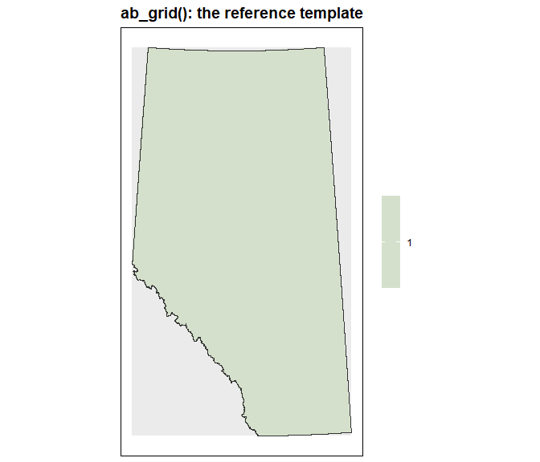
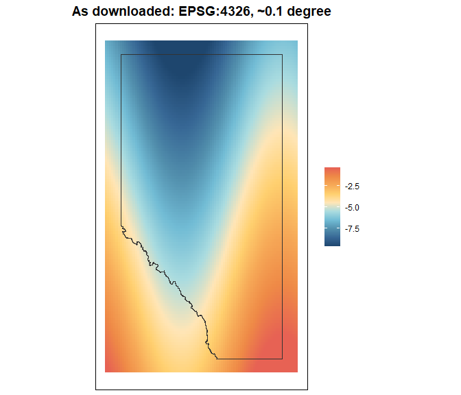
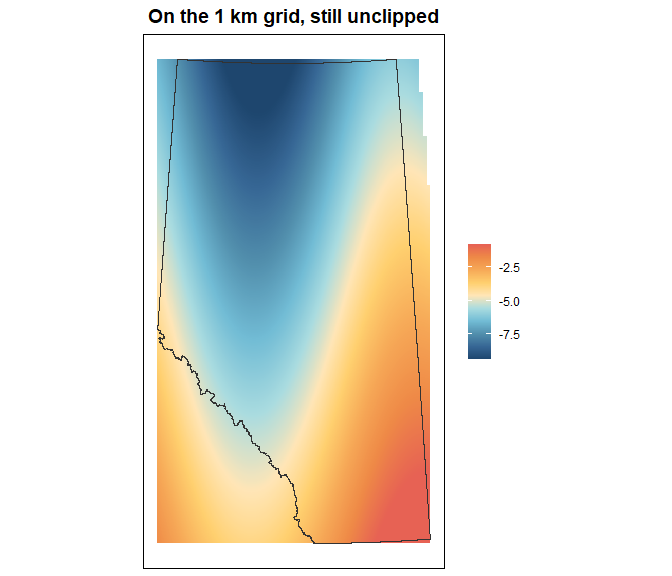
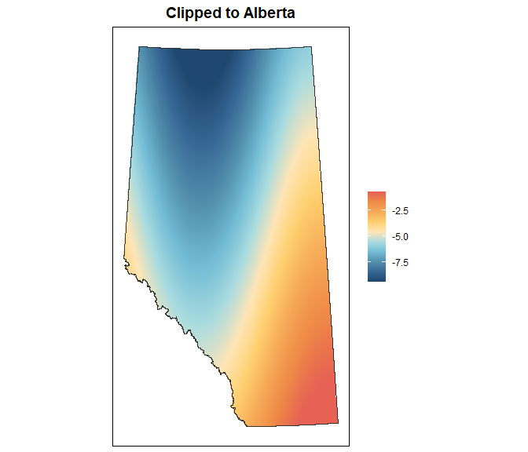
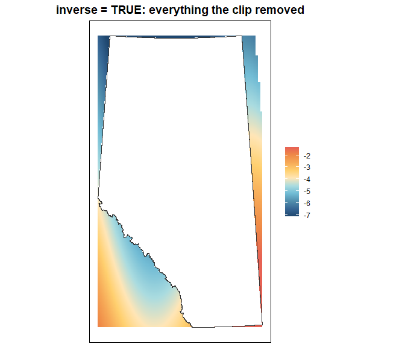

Harmonizing layers to the reference grid
================

``` r
library(sciSpatialR)
library(terra)
#> terra 1.8.50
library(sf)
#> Linking to GEOS 3.13.1, GDAL 3.10.2, PROJ 9.5.1; sf_use_s2() is TRUE
```

## One grid, three questions

Covariates arrive from wherever they were published — a global DEM in
geographic coordinates, a national land cover product at 30 m, a
provincial polygon layer. Before any of them can be stacked, extracted
from, or compared, they have to agree on the following properties:
coordinate reference system, extent, resolution, and origin.

The harmonization functions in this package address the following:

1.  **What am I aligning to?** The reference layers — `ab_crs()`,
    `ab_boundary()`, `ab_grid()`.
2.  **Does this layer already align?** `check_alignment()`.
3.  **How do I make it align?** `harmonize_crs()`, `resample_to_grid()`,
    `mask_to_boundary()`.

## The reference layers

### `ab_crs()`

The CRS everything harmonizes to: NAD83 / Alberta 10-TM (Forest).

``` r
ab_crs()
#> [1] "EPSG:3400"
```

It is a projected CRS in metres, which is what makes the rest of the
package sane — resolutions, buffer radii, and areas are all in the same
unit, and no function has to reason about degrees varying with latitude.

### `ab_grid()`

The ABMI 1 km reference grid, returned as a template `SpatRaster`:

``` r
ref <- ab_grid()
ref
#> class       : SpatRaster 
#> dimensions  : 1234, 695, 1  (nrow, ncol, nlyr)
#> resolution  : 1000, 1000  (x, y)
#> extent      : 170616.2, 865616.2, 5425532, 6659532  (xmin, xmax, ymin, ymax)
#> coord. ref. : NAD83 / Alberta 10-TM (Forest) (EPSG:3400) 
#> source      : grid_1km.tif 
#> name        : grid_1km 
#> min value   :        1 
#> max value   :        1
```

Cells covering Alberta hold `1`; everything else is `NA`. Of the 857,630
cells in the rectangle, the province occupies:

``` r
global(ref, "notNA")
#>           notNA
#> grid_1km 664762
```

Colouring the `NA` cells shows the shape of that: a rectangle of 1 km
cells, with values only where the province is.

``` r
plot_raster(
  ref,
  na_col = "grey92",
  main   = "ab_grid(): the reference template"
)
```



Two properties are worth knowing before you rely on it.

The template is \*snapped to the lattice of the ABMI’s 1 km grid
polygons (“\ABMI-DATA2\_data1SQKM_AB2020_gdb”)\*, not to a round number.
That is why the origin is an odd pair of values rather than `0, 0`:

``` r
origin(ref)
#> [1] -383.8178 -467.5689
```

The payoff is that a cell’s raster row and column reproduce its source
`GRID_LABEL`, so raster work and the ABMI grid tabulations refer to the
same cells.

Every raster cell is a full 1 km², whereas the source polygons along the
provincial boundary are clipped to less than that. Area-weighted work on
edge cells should go back to the source polygons on the share.
Provenance for both layers is in
[`inst/extdata/README.md`](https://github.com/bgcasey/sciSpatialR/blob/main/inst/extdata/README.md).

### `ab_boundary()`

The 2020 provincial boundary as one dissolved polygon, in the same CRS:

``` r
ab_boundary()
#>  class       : SpatVector 
#>  geometry    : polygons 
#>  dimensions  : 1, 0  (geometries, attributes)
#>  extent      : 170844.3, 865133.5, 5425575, 6659344  (xmin, xmax, ymin, ymax)
#>  source      : alberta.gpkg
#>  coord. ref. : NAD83 / Alberta 10-TM (Forest) (EPSG:3400)
```

It carries no attributes on purpose — it exists to clip, not to join to.

## Checking alignment

`check_alignment()` compares a layer against the reference on all four
properties and messages the result. The reference grid agrees with
itself:

``` r
check_alignment(ref)
#> CRS: OK
#> Extent: OK
#> Resolution: OK
#> Origin: OK
```

Something freshly downloaded usually does not. Here is a stand-in for
one — a synthetic temperature surface in geographic coordinates:

``` r
src <- rast(
  nrows = 120, ncols = 90,
  xmin = -121, xmax = -109,
  ymin = 48.5, ymax = 60.5,
  crs  = "EPSG:4326"
)
src <- 25 - 0.55 * init(src, "y") + 2 * sin(init(src, "x") / 2)
names(src) <- "mean_temp"
src
#> class       : SpatRaster 
#> dimensions  : 120, 90, 1  (nrow, ncol, nlyr)
#> resolution  : 0.1333333, 0.1  (x, y)
#> extent      : -121, -109, 48.5, 60.5  (xmin, xmax, ymin, ymax)
#> coord. ref. : lon/lat WGS 84 (EPSG:4326) 
#> source(s)   : memory
#> name        :   mean_temp 
#> min value   : -10.2473076 
#> max value   :   0.2970103
```

It covers Alberta and a good deal that is not Alberta, on its own grid,
in degrees. The provincial boundary is drawn on top for reference —
`plot_raster()` reprojects it to whatever the layer is in, which is the
only reason it lines up here at all:

``` r
plot_raster(src, main = "As downloaded: EPSG:4326, ~0.1 degree")
```



``` r
check_alignment(src)
#> CRS: MISMATCH — x and ref have different CRS.
#> Extent: MISMATCH.
#> Resolution: MISMATCH.
#> Origin: MISMATCH.
```

Four mismatches. The function returns the results invisibly as a named
logical vector, so it can act as TRUE/FALSE gate in a code pipeline.

``` r
ok <- check_alignment(src, verbose = FALSE)
ok
#>        crs     extent resolution     origin 
#>      FALSE      FALSE      FALSE      FALSE
all(ok)
#> [1] FALSE
```

`sf` objects are accepted too, but only the CRS is meaningful for them.
A point layer has no resolution or origin to compare, so those checks
are skipped rather than silently reported as failures:

``` r
pts <- st_as_sf(
  data.frame(
    site = c("calgary", "edmonton"),
    x    = c(-114.07, -113.49),
    y    = c(51.05, 53.55)
  ),
  coords = c("x", "y"),
  crs    = 4326
)
check_alignment(pts)
#> CRS: MISMATCH — x and ref have different CRS.
#> Extent, resolution, and origin checks skipped (x is an sf object).
```

## Get the CRS right first

**This is the step to not skip.** `resample_to_grid()` wraps
`terra::resample()`, which aligns a layer to a template but does *not*
reproject. Handed a layer in the wrong CRS it would treat the reference
extent as though it were in the layer’s own coordinates, find nothing
there, and return a raster of `NA` — a successful call producing an
empty layer. `resample_to_grid()` refuses instead:

``` r
resample_to_grid(src)
#> Error: CRS mismatch: `x` is WGS 84 and `ref` is NAD83 / Alberta 10-TM (Forest). resample_to_grid() does not reproject, and resampling across a CRS boundary returns an empty raster rather than an error. Reproject first:
#>   x <- terra::project(x, terra::crs(ref))
```

Reprojecting is a separate decision, so it stays a separate call:

``` r
src_ab <- project(src, ab_crs())      # bilinear, fine for continuous
check_alignment(src_ab, verbose = FALSE)[["crs"]]
#> [1] TRUE
```

The CRS now agrees; the grid geometry still does not, which is what
`resample_to_grid()` is for.

## Harmonizing rasters

### `resample_to_grid()`

With the CRS harmonized, resampling snaps the layer onto the reference
lattice:

``` r
temp_1km <- resample_to_grid(src_ab)
#> resample_to_grid(): method = "bilinear" — continuous layer, refining (res 10,266 → 1,000, each input cell spans ~105 output cells); interpolating between input cell centres. Pass method = "near" to keep the values blocky.
temp_1km
#> class       : SpatRaster 
#> dimensions  : 1234, 695, 1  (nrow, ncol, nlyr)
#> resolution  : 1000, 1000  (x, y)
#> extent      : 170616.2, 865616.2, 5425532, 6659532  (xmin, xmax, ymin, ymax)
#> coord. ref. : NAD83 / Alberta 10-TM (Forest) (EPSG:3400) 
#> source(s)   : memory
#> varname     : grid_1km 
#> name        :   mean_temp 
#> min value   : -10.0464020 
#> max value   :   0.1029203
aligned <- check_alignment(temp_1km, verbose = FALSE)
aligned
#>        crs     extent resolution     origin 
#>       TRUE       TRUE       TRUE       TRUE
```

All four properties now agree, which is the whole point: any two layers
put through this call can be stacked, differenced, or extracted from
together.

``` r
plot_raster(temp_1km, main = "On the 1 km grid, still unclipped")
```



Same surface, now in metres on the reference lattice — and still
carrying values well outside the province, which is what
`mask_to_boundary()` is for.

Notice the message. `terra::resample()` always returns a layer on the
reference geometry — that part is not in question. What varies is *how
each output cell gets its value*, and the right answer depends on which
way the resolution changes:

| Direction                   | Continuous   | Categorical |
|-----------------------------|--------------|-------------|
| Coarsening (fine to coarse) | `"average"`  | `"mode"`    |
| Same resolution             | `"near"`     | `"near"`    |
| Refining (coarse to fine)   | `"bilinear"` | `"near"`    |

`resample_to_grid()` reads `res(x)` against `res(ref)`, checks whether
the layer is categorical, picks from that table, and says what it
picked. Pass `method` to override it at any point.

Coarsening is the case that goes wrong quietly. A 30 m layer has roughly
1,111 cells inside every 1 km cell: `"average"` reads all of them,
`"bilinear"` reads four, `"near"` reads one. All three produce a
correctly aligned raster, and `check_alignment()` passes on all three,
because alignment is about geometry and this is a question about values.

``` r
fine <- rast(
  xmin = 400000, xmax = 430000,
  ymin = 5800000, ymax = 5830000,
  res  = 30, crs = ab_crs()
)
set.seed(1)
values(fine) <- runif(ncell(fine), 0, 30)
win <- crop(ref, ext(400000, 430000, 5800000, 5830000))

by_mean <- resample_to_grid(fine, win)
#> resample_to_grid(): method = "average" — continuous layer, coarsening (res 30 → 1,000, ~1,111 input cells per output cell); averaging all of them.
by_near <- resample_to_grid(fine, win, method = "near")
#> resample_to_grid(): method = "near" (supplied).

# both align; they do not agree
all(check_alignment(by_near, win, verbose = FALSE))
#> [1] TRUE
mean(abs(values(by_mean) - values(by_near)), na.rm = TRUE)
#> [1] 7.293292
sd(values(by_mean), na.rm = TRUE)
#> [1] 0.2946164
```

Class codes are the other half of the table. Interpolating between land
cover classes 1 and 3 produces a 2, which is meaningless. Build a
categorical layer from the same surface to see it:

``` r
zones <- classify(
  src,
  matrix(
    c(-Inf, -8, 1,
        -8, -5, 2,
        -5, -2, 3,
        -2, Inf, 4),
    ncol = 3, byrow = TRUE
  )
)
names(zones) <- "zone"
zones_ab <- project(zones, ab_crs(), method = "near")
sort(unique(values(zones_ab, na.rm = TRUE)))
#> [1] 1 2 3 4
```

A layer built this way holds class codes as plain numbers, so nothing
marks it as categorical and the automatic choice treats it as a
measurement. The codes become a continuum:

``` r
wrong <- resample_to_grid(zones_ab, method = "bilinear")
#> resample_to_grid(): method = "bilinear" (supplied).
length(unique(values(wrong, na.rm = TRUE)))
#> [1] 26056
range(values(wrong, na.rm = TRUE))
#> [1] 1 4
```

Naming the method keeps them intact:

``` r
zone_1km <- resample_to_grid(zones_ab, method = "near")
#> resample_to_grid(): method = "near" (supplied).
sort(unique(values(zone_1km, na.rm = TRUE)))
#> [1] 1 2 3 4
```

Detection works off `terra::is.factor()`, so a layer with a proper level
table is handled without being told:

``` r
zones_fct <- zones_ab
levels(zones_fct) <- data.frame(
  value = 1:4,
  zone  = c("cold", "cool", "mild", "warm")
)
auto_zone <- resample_to_grid(zones_fct)
#> resample_to_grid(): method = "near" — categorical layer, refining (res 10,266 → 1,000, each input cell spans ~105 output cells); nearest keeps the class codes intact.
sort(unique(values(auto_zone, na.rm = TRUE)))
#> [1] 1 2 3 4
```

Anything holding class codes as bare numbers needs `method =` given
explicitly. That is the one thing the automatic choice cannot see.

### Any resolution ratio

Summarising the fine cells does not require the resolutions to divide
evenly. `terra::resample()` works per output cell — each 1 km cell reads
whatever falls inside it, 1,111 cells or 1,123 — rather than tiling the
input into fixed blocks. A 300 m layer, which does not divide into 1 km
at all, lands on the grid exactly:

``` r
odd <- rast(
  xmin = 400000, xmax = 430300,
  ymin = 5800000, ymax = 5830300,
  res  = 300, crs = ab_crs()
)
odd <- init(odd, "y")
res(odd)
#> [1] 300 300

odd_1km <- resample_to_grid(odd, win)
#> resample_to_grid(): method = "average" — continuous layer, coarsening (res 300 → 1,000, ~11 input cells per output cell); averaging all of them.
res(odd_1km)
#> [1] 1000 1000
all(check_alignment(odd_1km, win, verbose = FALSE))
#> [1] TRUE
```

Why `terra::resample()` and not `terra::aggregate()`?
`terra::aggregate()` is more limited. Aggregation coarsens by an integer
factor, and a factor is a single number: 1000 / 300 rounds to 3, giving
900 m cells. It also lays its blocks out from the input’s own corner, so
it changes cell size without changing position.

### Summaries beyond the mean

`method` accepts everything `terra::resample()` does, which covers most
of what a coarse cell might need to say about the fine cells inside it:

``` r
totals <- resample_to_grid(fine, win, method = "sum")
#> resample_to_grid(): method = "sum" (supplied).
spread <- c(
  resample_to_grid(fine, win, method = "min"),
  resample_to_grid(fine, win, method = "max")
)
#> resample_to_grid(): method = "min" (supplied).
#> resample_to_grid(): method = "max" (supplied).
names(spread) <- c("min", "max")
global(spread, "mean", na.rm = TRUE)
#>            mean
#> min  0.02707072
#> max 29.97271530
```

`"sum"`, `"min"`, `"q1"`, `"median"`, `"q3"`, `"max"`, and `"rms"` are
all available, alongside `"average"` and `"mode"`.

For a summary not on that list — a standard deviation, an interquartile
range, a function of your own — drop to `terra::aggregate()`, which
takes an arbitrary function, then resample its output to snap it into
place:

``` r
het <- aggregate(fine, fact = 33, fun = sd)   # 990 m, off-lattice
het_1km <- resample_to_grid(het, win)
#> resample_to_grid(): method = "average" — continuous layer, coarsening (res 990 → 1,000, ~1 input cell per output cell); averaging all of them.
all(check_alignment(het_1km, win, verbose = FALSE))
#> [1] TRUE
```

Two steps, and only because `sd` is not one of the built-in methods. For
a mean, a mode, or a sum, one call does both jobs.

### Reading the message

`resample_to_grid()` reports its choice and the reason on every call. In
a loop over a folder of covariates that log is the record of what
happened to each layer, and it is where a surprise shows up — a layer
you thought was 1 km turning out to be 250 m, or a class raster being
treated as continuous because its codes are stored as plain numbers.
Pass `quiet = TRUE` to silence it.

The choice is a default, not a constraint. `method` overrides it
whenever the layer’s meaning calls for something else — `"sum"` for
counts, `"near"` for a layer whose exact values must survive,
`"bilinear"` for a coarse smooth surface being refined.

### `mask_to_boundary()`

Harmonizing to the grid gives a layer the right geometry but not the
right footprint: a reprojected national product still carries values
across almost the whole reference rectangle, including well outside
Alberta.

``` r
global(temp_1km, "notNA")
#>            notNA
#> mean_temp 852260
```

Masking clips it to the province. The default boundary is `"alberta"`,
so the common call takes no second argument:

``` r
temp_ab <- mask_to_boundary(temp_1km)
global(temp_ab, "notNA")
#>            notNA
#> mean_temp 664749
```

``` r
plot_raster(temp_ab, main = "Clipped to Alberta")
```



`inverse = TRUE` keeps the outside instead — useful for checking what a
clip removed, or for building an outside-Alberta mask:

``` r
global(mask_to_boundary(temp_1km, inverse = TRUE), "notNA")
#>        notNA
#> layer 187511
```

``` r
plot_raster(
  mask_to_boundary(temp_1km, inverse = TRUE),
  main = "inverse = TRUE: everything the clip removed"
)
```



The two together account for every cell that had a value before the
mask, which is the check worth doing when a clip looks suspicious.

## Harmonizing points

Reprojecting points:

``` r
pts_ab <- harmonize_crs(pts)
#> Reprojecting `points` to the reference grid CRS (NAD83 / Alberta 10-TM (Forest)).
st_crs(pts_ab)$input
#> [1] "NAD83 / Alberta 10-TM (Forest)"
st_coordinates(pts_ab)
#>             X       Y
#> [1,] 565160.9 5653533
#> [2,] 600000.8 5932142
```

## A worked pipeline

Everything above, as it would appear in a covariate-preparation script —
a downloaded continuous layer and a point set, both brought onto the
reference grid:

``` r
# 1. Check what arrived
check_alignment(src)
#> CRS: MISMATCH — x and ref have different CRS.
#> Extent: MISMATCH.
#> Resolution: MISMATCH.
#> Origin: MISMATCH.

# 2. CRS first; nothing else works until this passes
covariate <- project(src, ab_crs())

# 3. Snap to the reference grid
covariate <- resample_to_grid(covariate)
#> resample_to_grid(): method = "bilinear" — continuous layer, refining (res 10,266 → 1,000, each input cell spans ~105 output cells); interpolating between input cell centres. Pass method = "near" to keep the values blocky.

# 4. Clip to Alberta
covariate <- mask_to_boundary(covariate)

# 5. Confirm, do not assume
check_alignment(covariate)
#> CRS: OK
#> Extent: OK
#> Resolution: OK
#> Origin: OK

# 6. Bring the points into the same CRS
sites <- harmonize_crs(pts)
#> Reprojecting `points` to the reference grid CRS (NAD83 / Alberta 10-TM (Forest)).
```

``` r
covariate
#> class       : SpatRaster 
#> dimensions  : 1234, 695, 1  (nrow, ncol, nlyr)
#> resolution  : 1000, 1000  (x, y)
#> extent      : 170616.2, 865616.2, 5425532, 6659532  (xmin, xmax, ymin, ymax)
#> coord. ref. : NAD83 / Alberta 10-TM (Forest) (EPSG:3400) 
#> source(s)   : memory
#> varname     : grid_1km 
#> name        :   mean_temp 
#> min value   : -9.99693680 
#> max value   :  0.04908441
```

From here `extract_points()` and the other extraction functions take
over; they are covered separately.

## Working off the default grid

Every reference default is an ordinary argument, so a project on a
different grid — a 250 m analysis, a single natural subregion, work
outside Alberta — overrides it in place:

``` r
own_ref <- rast(
  xmin = 400000, xmax = 500000,
  ymin = 5800000, ymax = 5900000,
  res  = 250, crs = ab_crs()
)
own <- resample_to_grid(src_ab, ref = own_ref)
#> resample_to_grid(): method = "bilinear" — continuous layer, refining (res 10,266 → 250, each input cell spans ~1,686 output cells); interpolating between input cell centres. Pass method = "near" to keep the values blocky.
all(check_alignment(own, ref = own_ref, verbose = FALSE))
#> [1] TRUE
```

`ref` is the argument for `check_alignment()` and `resample_to_grid()`;
`raster` for `harmonize_crs()`; `boundary` for `mask_to_boundary()`. The
package’s own reference layers are just the defaults those arguments
carry, not a requirement.

`"alberta"` is the only boundary shortcut `mask_to_boundary()`
recognises, because it is the only boundary that ships with the package.
Anything else is passed as a polygon, including layers read off the
share — natural regions and subregions are
`get_layer("natural_regions_subregions_of_alberta")`.
